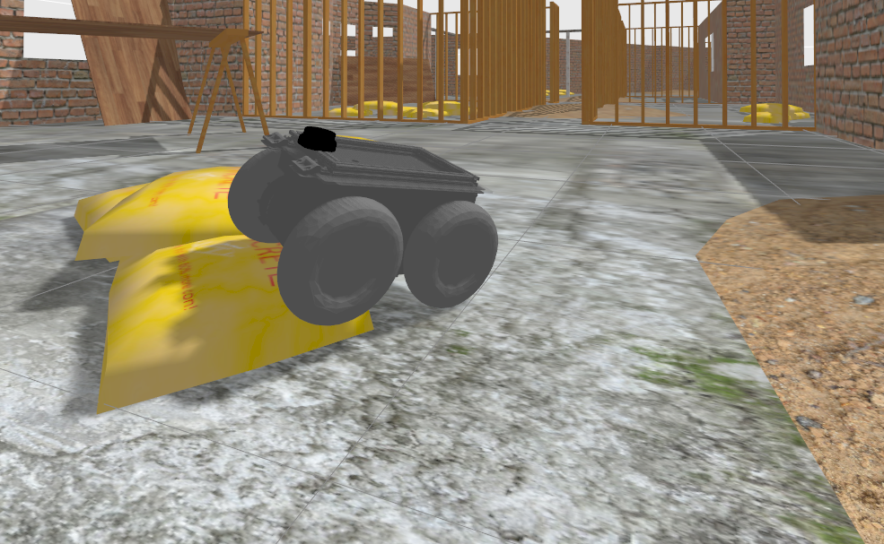
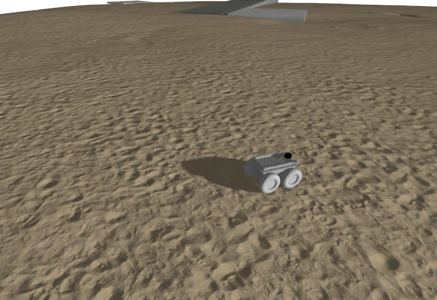
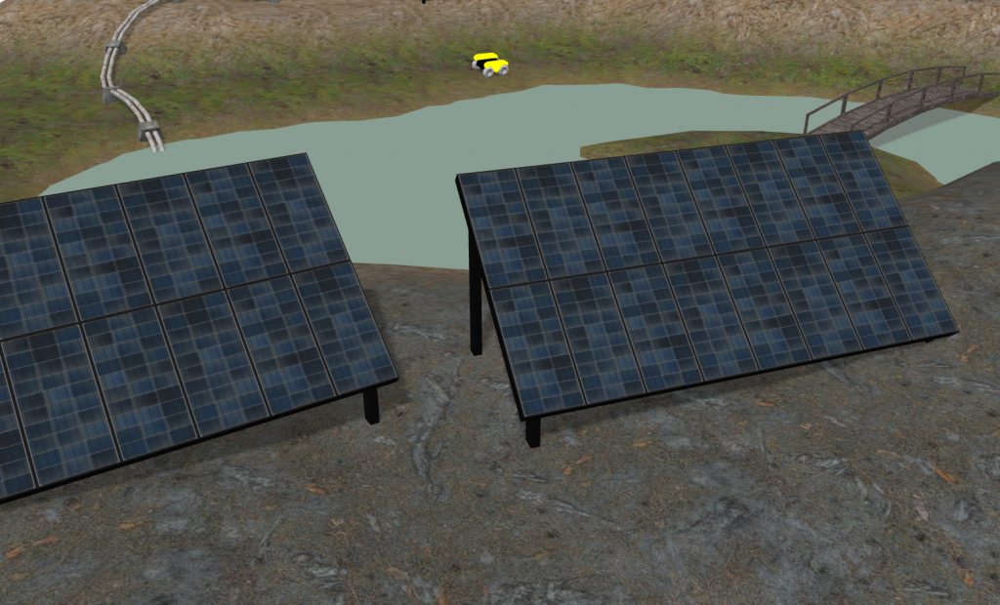

# Off-Road Mobile Robot Simulation and Reinforcement Learning Framework

[](LICENSE)


<div align="center">
  <p float="left">
    
    
    
  </p>
</div>

This repository provides a comprehensive framework for off-road mobile robot research, integrating ROS 2 Humble, Gazebo Fortress, and PyTorch with Stable Baselines3 (SB3) and a Gymnasium interface for reinforcement learning. It includes the models for the Rover Zero, Clearpath Husky and Leo Rover platforms and as well as mutiple outdoor Gazebo environments to include industrial inspection, agricultural and construction sites. Autonmated metrics logging includes Success Rate (SC), Total Collisions (TC), Mean time to Traverse (MTT), Travers Rate (TR), and Velocify Over Rough terrain (VOR).  This framework serves as a foundation for developing and testing mobile robot tasks on unstructured terrain.

---

## Table of Contents

- [Introduction](#introduction)
- [Features](#features)
- [Prerequisites](#prerequisites)
- [Getting Started](#getting-started)
  - [Clone the Repository](#clone-the-repository)
  - [Build the Docker Image](#build-the-docker-image)
  - [Run the Docker Container](#run-the-docker-container)
- [Using the Framework](#using-the-framework)
  - [Launching the Simulation](#launching-the-simulation)
  - [Running the PPO PointNav RL Agent](#running-the-ppo-pointnav-rl-agent)
- [Repository Structure](#repository-structure)
- [Contributing](#contributing)
- [License](#license)

---

## Introduction

This project aims to facilitate off-road mobile robot research by providing a ready-to-use simulation environment and tools for developing reinforcement learning agents. It leverages:

- **ROS 2 Humble**: The latest ROS 2 distribution for robotics development.
- **Gazebo Fortress**: A powerful simulation environment compatible with ROS 2 Humble.
- **PyTorch and Stable Baselines3**: For implementing PPO (Proximal Policy Optimization) RL agents.

The framework is designed to simulate the Rover Zero robot, but it can be extended to other platforms.

## Features

- **Off Road Robot Simulation**: Models of the Rover Zero, Leo Rover and Clearpath Husky platforms in Gazebo Fortress.
- **Reinforcement Learning Integration**: Placeholder and structure for implementing SB3 PPO PointNav RL agents.
- **ROS 2 Workspace**: Includes necessary ROS 2 packages and custom code.
- **Extensibility**: Modular design allows for integration of additional robots and sensors.

## Prerequisites

- **NVIDIA Container Toolkit**: Required if you plan to use GPU acceleration.
  - Installation instructions: [NVIDIA Container Toolkit](https://docs.nvidia.com/datacenter/cloud-native/container-toolkit/install-guide.html)
- **X11 Server**: For GUI applications like Gazebo (usually available on Linux systems).

## Getting Started
### Installation
Main dependencies: 

* [ROS2 Humble](https://docs.ros.org/en/humble/Installation/Ubuntu-Install-Debs.html)
* [Gazebo Fortress](https://gazebosim.org/docs/latest/ros_installation/)
* [Stable Baselines 3](https://github.com/DLR-RM/stable-baselines3)

### Clone the Repository

```bash
git clone https://github.com/your_username/your_repository.git
cd your_repository
```

## Using the Framework

### Launching the Simulation

Inside the Docker container, source the ROS 2 workspace and launch the Rover Zero simulation.

```bash
# Source ROS 2 and workspace setup files
source /opt/ros/humble/setup.bash
source /home/ros2_ws/install/setup.bash

# Launch the Rover Zero simulation
ros2 launch roverrobotics_gazebo 4wd_rover_gazebo.launch.py
```

Gazebo should open on your host machine, displaying the Rover Zero robot in the simulation environment.

### Running the PPO PointNav RL Agent

**Placeholder Section**

This section provides a placeholder for integrating your SB3 PPO PointNav RL agent. Follow these steps to set up and run your agent:

1. **Implement the PPO Agent**: Develop your RL agent using Stable Baselines3 and PyTorch. Place your code in the `ros2_ws/src/ppo_agent` directory.

2. **Training Script**: Create a training script that interacts with the ROS 2 simulation environment.

   Example structure:

   ```python
   # ppo_agent/train.py

   import gym
   from stable_baselines3 import PPO
   # Additional imports

   # Define the custom environment that interfaces with ROS 2
   env = gym.make('YourCustomEnv-v0')

   # Initialize the PPO model
   model = PPO('MlpPolicy', env, verbose=1)

   # Train the model
   model.learn(total_timesteps=100000)

   # Save the trained model
   model.save('ppo_pointnav_model')
   ```

3. **Custom Environment**: Implement a custom Gym environment that interfaces with ROS 2 topics and services.

   ```python
   # ppo_agent/env.py

   import gym
   from gym import spaces
   # ROS 2 imports

   class YourCustomEnv(gym.Env):
       def __init__(self):
           # Define action and observation spaces
           # Initialize ROS 2 publishers and subscribers
           pass

       def step(self, action):
           # Apply action to the robot
           # Get observations
           # Calculate reward
           # Check if done
           return observation, reward, done, info

       def reset(self):
           # Reset the simulation
           return observation

       def render(self, mode='human'):
           # Optional: Render the environment
           pass

       def close(self):
           # Cleanup
           pass
   ```

4. **Running the Training Script**: Inside the Docker container, run your training script.

   ```bash
   python3 /home/ros2_ws/src/ppo_agent/train.py
   ```

5. **Evaluation**: After training, you can evaluate your agent by running it in the simulation and observing its performance.

**Note**: Ensure that all ROS 2 nodes and the simulation are running before starting the training script.


## Repository Structure

```
project_root/
├── metrics_analyzer
├── ros2_ws/
│   ├── src/
│   │   ├── roverrobotics_ros2/       # Rover Robotics packages
│   │   ├── ppo_agent/                # Your PPO agent code
│   │   └── other_ros2_packages/      # Additional ROS 2 packages
│   ├── install/
│   ├── build/
│   └── log/
├── LICENSE
└── README.md
```

# Robot Navigation Metrics Analysis

This system provides tools for logging and visualizing robot navigation metrics in ROS2, particularly useful for analyzing robot performance over rough terrain.

## System Components

1. **Metrics Node** (`metrics_node.py`): 
   - ROS2 node that collects real-time metrics
   - Subscribes to key topics: `/scan`, `/imu/data`, `/rover/pose_array`, `/odometry/wheels`
   - Logs data to timestamped CSV files

2. **Metrics Analyzer** (`cli_main.py`):
   - Command-line tool for analyzing and visualizing the collected metrics
   - Supports multiple data files for trial comparison
   - Generates publication-ready plots

## Usage Instructions

### 1. Data Collection

First, ensure ROS2 and your robot simulation/hardware are running. Then:

Launch the metrics logging node
ros2 run rover_metrics metrics_node

This will create a CSV file in `/metric_logs` with timestamp and metrics including:
- Total Collisions
- Obstacle Clearance
- Current Velocity
- IMU Acceleration Magnitude
- Rough Terrain Detection

### 2. Data Visualization

After collecting data, use the metrics analyzer to visualize results:

Basic usage (plot all metrics)
python cli_main.py path/to/metrics_log.csv

Compare velocity and IMU data from multiple trials
python cli_main.py trial1.csv trial2.csv -m CV IM -p time_series

Available metrics flags:
TC: Total Collisions
CS: Current Collision Status
SM: Smoothness Metric
OC: Obstacle Clearance
DT: Distance Traveled
CV: Current Velocity
IM: IMU Acceleration Magnitude
RT: Is Rough Terrain

### 3. Output

The visualization tool will create:
- Individual metric plots
- Combined comparison plots for multiple trials
- Special visualization for velocity vs. terrain roughness

Output files are saved in:
output/combined_metrics/

## Examples

### Single Trial Analysis
python cli_main.py metrics_log_20250105_190453.csv -m CV IM -p time_series

### Multiple Trial Comparison
python cli_main.py \
    metrics_log_20250105_190453.csv \
    metrics_log_20250105_190759.csv \
    -m CV IM -p time_series


- **ros2_ws/**: ROS 2 workspace containing all source code.
  - **src/**: Source directory for ROS 2 packages and PPO agent.
  - **install/**, **build/**, **log/**: Generated after building the workspace.

## Contributing

Contributions are welcome! Please follow these guidelines:

1. **Fork the repository** and create a new branch for your feature or bug fix.
2. **Ensure code quality** by following best practices and including docstrings.
3. **Submit a pull request** with a detailed description of your changes.


## License

This project is licensed under the Apache License 2.0 - see the [LICENSE](LICENSE) file for details.

```
                                 Apache License
                           Version 2.0, January 2004
                        http://www.apache.org/licenses/

   TERMS AND CONDITIONS FOR USE, REPRODUCTION, AND DISTRIBUTION


```


## Third-Party Licenses

This repository integrates components from several open-source projects. The licensing details for these components are as follows:

- **Gazebo Fuel Terrain Models**: Apache 2.0 License. See [gazebosim.org](https://app.gazebosim.org/dashboard).
- **Rover Zero Robot Model**: Apache 2.0 License. See [Rover Robotics Repository](https://github.com/roverrobotics).
- **Leo Rover Robot Model**: MIT License. See [Leo Rover Repository](https://github.com/LeoRover/leo_robot).
- **Clearpath Robotics Terrain and Husky Models**: BSD License. See [Clearpath Robotics Repositories](https://github.com/clearpathrobotics).

Each license allows for reuse and distribution with proper attribution and adherence to their terms.


For the full license text, please refer to the [LICENSE](LICENSE) file included in the repository.

---


